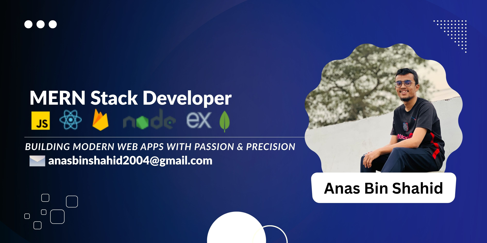

  

  

### MERN Stack Developer | Passionate About Web Development

---

## About Me
I am a full-stack developer with a focus on **MERN stack**. I enjoy building modern web applications and learning new technologies to enhance my skills.  
Currently, I am working on personal projects to improve my web development portfolio.

### Current Activities
- 🌐 Building a **delivery website** with modern UI/UX  
- 💻 Improving **full-stack MERN skills** through real-world projects  
- ⚛️ Learning **Advanced React** (optimization, custom hooks, patterns)  
- 🎨 Enhancing **Tailwind CSS** skills by creating different UI/UX-based projects  
- 🔐 Working on **Authentication & Authorization** (JWT, OAuth)  
- 🚀 Exploring **deployment workflows**, CI/CD & production best practices  
- 🤖 Experimenting with **AI-powered development** tools & workflows  
- 🐳 Getting hands-on with **Docker basics** for smoother deployment   

---

## 🧰 TECHNOLOGY STACK:

---

### 🔗 Languages:

  
  
  

### 🔗 Frontend:

  
  
  

### 🔗 Backend:

  
  

### 🔗 Database:

  

### 🔗 Tools:

  
  
  
  

### 🔗 Deployment:

  
  
   

---

## Social Links

  
  
  
  

